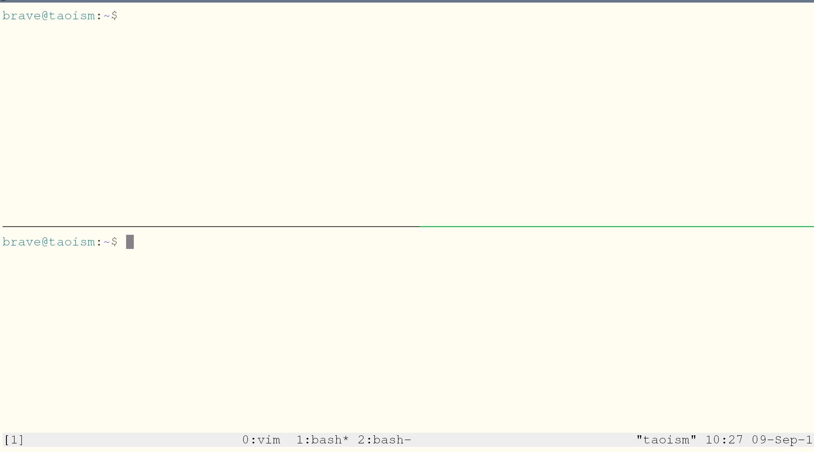
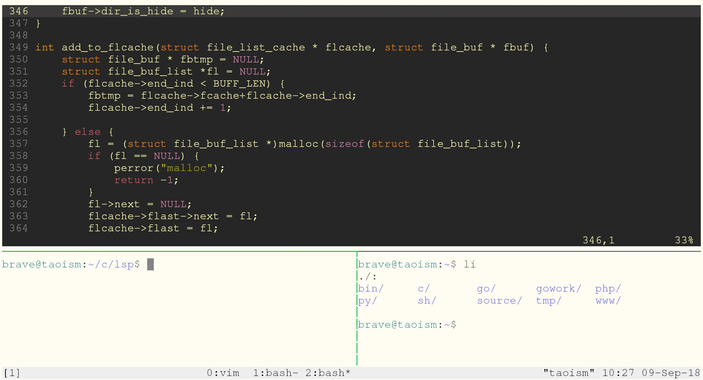
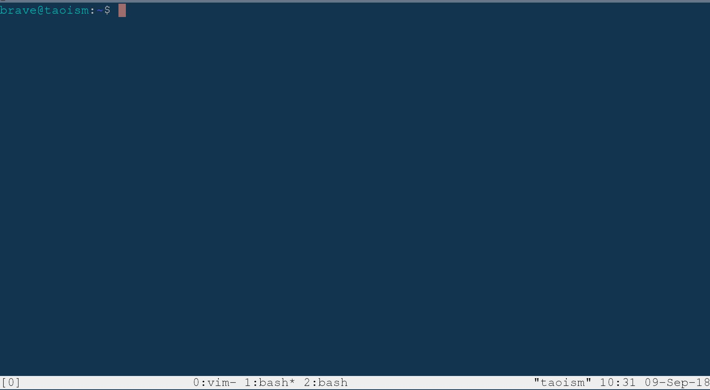

## Linux系统及程序设计 - 绪论

### 课程介绍

本课程是Linux系统基础的进阶课程，主要讲述Linux系统编程，并包括部分Web的内容，Web部分主要是Linux服务端搭建、Web架构与特点，系统编程部分主要使用C语言调用Linux系统接口（系统API）完成一些命令，由此更深入的理解Linux工作方式，并体会Linux/Unix平台的简洁、分工、组合的编程思想（KISS原则：Keep it small , stupid）。

本课程以编程实践为主，涉及到man查看的手册内容，并非全部内容，而是精简了一些系统API或是库函数的主要说明。你应该在需要时查看完整的手册。本课程的目的不仅仅是要告诉你如何使用系统API以及库函数实现需要的功能，更重要的是熟悉在Linux/Unix平台上的开发习惯，开发方式。理解Linux/Unix的设计思想。

课程总共16章，每一章分为多个小节，每一节带 * 的标题是选修内容，带#标题是课外拓展内容。

课程链接：https://github.com/master-genius/course-lsp

### Linux平台简介与回顾

熟悉Windows的用户可能觉得Linux使用量很小，并且很不好用。但事实是Linux平台在服务器市场以及嵌入式市场获得了巨大生命力，包括你见到的各种智能设备尽管它们提供了美观的界面，易用的操作方式，但是大部分都采用Linux内核。在这些领域Linux占有绝对的优势，而这种优势来自于Linux的高效设计，Linux继承自Unix禅宗般的简洁设计哲学，并且由于Linux是开源的，可以自由传播和使用，这还可以降低产品成本。

当然，使用Linux是需要付出一些努力的，需要一些时间去理解。当一旦能够熟练使用，就能够体会到Linux的强大，并且在其他领域也会有很好的帮助。

### 编程语言和工具

本课程主要使用C语言，并且使用gcc编译工具。辅助使用shell脚本等其他脚本语言。

虽然本课程使用C实现相应的功能，但是理解了系统API的工作方式，使用一些高级语言如Java，Python等调用系统相关接口会更加得心应手，因为高级语言的接口都依赖于系统底层的实现。

glibc：GNU C Library project。GNU发布的C运行库，glibc可以说是包罗万象，囊括了几乎所有Unix的通行标准，这样编写的程序可移植性很强。并且glibc封装了非常原始的内核调用，对外提供简单易用的接口。

本课程使用的Linux环境可以是物理机安装的系统，也可以是虚拟机安装。对于使用物理机安装的系统来说，自带的终端支持多标签，除此之外，tilda和guake也是很好的选择，可以一键显示或隐藏窗口。使用虚拟机的情况，可以使用Putty，Xshell，MobaXterm。这三个都是ssh客户端，选择一个即可。

在终端环境里，有一个非常好用的开发工具：tmux。这个工具主要用于多标签，分屏等操作：

putty+tmux是很好的组合，putty简洁单一的窗口启动tmux，对于开发来说是非常好的选择。

**传文件**：如果需要上传文件到虚拟机，这里推荐两个软件：WinSCP，FileZilla。FileZilla支持Linux版本。putty工具集中有用于上传文件的命令，操作起来比较麻烦。对于虚拟机系统使用ssh服务的情况，客户端传文件使用的协议是sftp。

**代码编辑器**：使用Vim作为主要的代码编辑工具，在桌面环境，使用Visual Studio Code、Sublime Text 3或是其他IDE工具也是可以的。

### 课程定位以及其他说明

整个计算机领域从大方向划分，可分为硬件和软件，然而在硬件和软件对接的领域，比如编写设备驱动程序，程序和硬件耦合非常紧密，程序要针对不同硬件平台进行设计，而硬件的设计也会随着软件开发需求而变化。嵌入式也是一个需要软硬件结合的领域，嵌入式可以很简单，比如电梯控制，也可以很复杂，像火星探测器，据说好奇号火星探测器超过300万行代码，使用C语言编写，测试脚本使用的Python。

我们的专业属于纯粹的软件领域，不会直接和硬件打交道，当然如果能理解计算机硬件的基本运行原理对编写软件会很有帮助。

本课程除了可以让你更好的理解Linux运行原理、提高编程能力以外，对后续的课程以及工作也 ‘可能’ 会有所帮助，注意为什么用可能这个词，因为在实际的工作场景你不一定会涉及到相对底层的开发，比如我们都会使用PHP/Python/JavaScript/Java等高级语言编程，但是像PHP/Python等高级语言都支持C扩展，而且有些扩展为了运行效率必须要使用C开发。可是多数情况下我们是不需要自己去写C扩展的。

再比如Redis、Memcached等这些中间件服务程序，作为内存型数据库用于数据快速存取，并且Redis还可作为消息队列使用。这些程序都是使用C语言开发的，并且都提供在Linux平台上版本，Linux提供了epoll函数实现了IO多路复用，Redis基于此开发，所以性能非常高。而Windows上并未开放类似的接口，所以Redis官方并未提供Windows版本。其他提供服务的程序：Nginx，Apache等都是用C语言开发的，Nginx同样是基于Linux 的epoll接口实现了高并发的处理。

本课程会对这些技术依赖的底层系统调用以及运行机制使用程序示例做一个简要说明。如果你感兴趣，可以看看《Linux system programming》以及《Advanced Programming in the UNIX Environment third edition》（《Unix环境高级编程 第三版》简称《APUE》）后者可以说是大名鼎鼎，目前最新版是第三版，删除了过时的接口，增加了新的接口，针对Unix以及类Unix几种主流系统都提供了比较好的描述和实例。

### 准备工作

学生要具备C语言基础，Linux系统基础，最好能理解基本的数据结构和算法，一台能够运行Linux环境的设备，建议使用物理机安装Linux系统，虚拟机环境也可以。

本节课主要任务就是安装Linux操作系统，并且安装gcc以及vim，可以使用桌面版本Linux，并且可以使用visual studio code、sublime text 3等桌面环境的开发工具。（visual studio code不是visual studio，是微软提供的一个免费的代码编辑器，支持Linux版本）。

### Linux发行版

#### deepin

deepin是国内开发的一个Linux发行版，可以称得上桌面环境最好看的发行版，在国外也有很多的用户使用量。桌面环境是完全自主研发的，没有使用gnome，kde等进行二次开发，使用体验会更好。并且提供了一些其他桌面环境没有的工具。deepin开发公司购买了crossover版权，这样你无需付费就可以使用crossover运行Windows程序。另一个比较好的体验是deepin的联机文档很多是翻译成中文的。deepin经过了很多年的发展，综合使用体验deepin对国内来说是最好的。

#### Mint

这个版本在使用排名上一直稳居第一（现在Mint排名居于第二，第一名被Manjaro抢占），Mint有一个基于gnome3开发的桌面环境cinnamon。除此以外，还提供Mate桌面版本以及Xfce桌面版本。Mint主要针对Linux新手，普通用户做了很多设计。实际上对开发人员来说也是非常好的选择。Mint基于Ubuntu进行开发，但是桌面环境更好用一点。

#### Ubuntu

Ubuntu上手方便，很多开发要用到的环境都是配置好的，Ubuntu的桌面版本比较激进，追求软件、内核的最新版本。不过UbuntuServer版本部署在服务器上还是很稳定的。Ubuntu基于Debian开发，并针对用户体验做了优化，Ubuntu是公司运营的，会有一些商业相关的预装软件，不过可以卸载。曾经Ubuntu基于gnome开发了自己的桌面环境unity，从Ubuntu18.04开始，使用gnome3作为默认桌面环境，放弃了unity。Ubuntu的特点就是上手更容易，集成的开发库也比较全面，尤其是基于Debian的包管理非常方便，软件库也比较全。

#### Debian

社区驱动的Linux发行版，Debian是绝对开源的发行版，不会有任何的商业成分。Debian是一个社区开发的版本，没有公司去运营。但是很多发行版都直接或间接基于Debian。使用Debian需要一些更多的设置，不过当前Debian也针对用户的使用体验做了很多工作，对语言的支持也更完善。但是软件的更新程度不像Ubuntu，比较慢，甚至有时候很长时间不更新，往往需要手动更新。

#### CentOS

RedHat发布的开源版本，国内使用很多，软件更新慢，追求稳定，多用于部署服务器。不过现在使用Ubuntu/Debian部署的服务器也在增加。CentOS和RetHat使用相同的包管理程序。尽管你在网上会找到很多为何多数使用CentOS部署服务器的说明，但是那些都是个人之见，因素使多种多样的，当你想部署服务的时候，Ubuntu，Debian，CentOS都是很好的选择。

#### Manjaro

从发布以来，排名一直上升，现在居于第一。基于Arch开发，Arch虽然功能强大，但是需要大量配置，不是很好用。并且不适合新手。所以才有了manjaro项目，融合Arch的优势，同时提供更好用的桌面环境。

> ！2018年8月28日，测试发现很多发行版都出现了无法引导的问题，据其他人反应，很多人都出现了这个问题，据说是最新版本的系统启动程序存在bug。目前我个人使用来看，Ubuntu16.04，18.04都可以正常使用，CentOS7也没有问题。Manjaro、Deepin都出现了此问题，Mint最新版本基于Ubuntu18.04开发，双系统安装出现重启后进不去系统的问题（报错：PCIe Error，此问题需要修改grub配置文件，这个问题比较好解决，Ubuntu只有在切换到控制台才会出现，而Mint出现的问题是直接进不去系统）。
>
> ！如果你使用虚拟机运行Mint桌面环境会进入软件渲染模式，界面很卡，可以尝试其他发行版，根据配置信息可以选择桌面版还是Server版。

