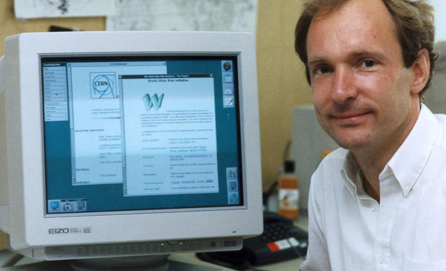

## Web基础介绍

Web是 World Wide Web的简称。中文翻译为：万维网。讲到Web不得不提到的人是：蒂姆·伯纳斯·李。



他发明了万维网，蒂姆就读于牛津大学的物理系，1976年毕业。1984年在欧洲原子核研究会建立的粒子实验室工作。在这期间，蒂姆希望找到一个方式可以把各种信息进行共享，就像人的神经网络，当我找到一个点，可以联系到很多相关的数据。

他很快取得了成功，但是蒂姆并不满足于小范围的信息共享，开始把目标转向**全球**。蒂姆开始设计开发能够让全球都能够给进行信息共享的技术。根据伯纳斯·李的构想，需要设计一个模型对接起 Web 客户端和 Web 服务器，承载起相互链接的超文本信息所组成的系统。在这个系统下，文档和其他形式的资源组成了网页，网页又组成了网站。每个网站都有一个独特的地址，这个就是现在所说的URL。


超文本技术很早就已经出现，在1980年代后期，人们总是热衷于各种学术论文以及开各种交流会议，很少有人想到能把它用于互联网。蒂姆组合了HTTP协议和超文本技术。1989年，蒂姆成功开发出世界上第一个Web服务器和Web客户端。当时功能还很简陋。但是这已经是非常了不起的成就，奠定了当前互联网技术的基础。

实际上网络技术1960年代已经诞生了，但是直到1980年代，上网都是一件十分麻烦的事情，只有比较专业人员才能操作，而且能见到的内容都是十分枯燥的。1989年是一个转折点，WWW技术给互联网赋予了强大的生命力，而现在我们已经离不开网络。

蒂姆并没有把这项技术用于商业化，而是让大家免费使用，因为他不想因为商业化而出现其他各种网络：比如苹果网，google网，微软网等，那些公司肯定会搞出一套自己的技术标准用于商业竞争。那样的话我们会面对各种复杂的不兼容的网络环境。尽管他发明了这项伟大的技术，但是没有从中获取任何利益。

蒂姆·伯纳斯·李被尊称为“互联网之父”，这是当之无愧的。和其他推动人类进程的发明不同，万维网是蒂姆个人的劳动成果。


**W3C**：万维网联盟，蒂姆·伯纳斯·李创办的组织，并担任主席，在全球有多个办事处。也会与其他组织合作，制定并发布多项Web技术标准。

#### 协议

目前Web主要使用的协议是HTTP/HTTPS，HTTPS是使用SSL加密的传输技术，并没有改变HTTP的本质。HTTP最新的版本是HTTP/2.0，主流使用的是HTTP/1.1，而HTTP/1.0已经极少见到。

HTTP的全称是HyperText Transfer Protocol（超文本传输协议）。HTTP是基于TCP协议的。尽管TCP是持久连接的，但是HTTP会在传输完成后关闭连接。

HTTP/1.0是在传输完成后立刻关闭连接，而HTTP/1.1允许通过keep-alive选项保持一段时间的连接，在这期间如果还有数据传出不必建立新的连接。但是要区分TCP的KEEPALIVE选项，HTTP的keep-alive就是设定一个连接保持时间。

HTTP是使用文本形式传输的，数据可以直接看到。但是HTTP/2.0打破了这一规则，使用了二进制传输，如果需要查看各项信息需要专门的解析软件。HTTP/2.0主要是为了优化性能，提高传输效率，并且兼容HTTP/1.1的语义。

尽管HTTP的设计基于TCP协议，但是这不是一个强制的规定，HTTP/3标准正在制定中，基于QUIC协议（Quick UDP Internet Connection 快速UDP网络连接）。此项技术可以让网络连接更快，能支持更多的连接请求。

**HTTP客户端**：浏览器就是支持HTTP协议的客户端，现在的浏览器支持的协议很多，功能也非常多。只要是实现了HTTP协议的程序，都可以作为客户端，并不局限于浏览器。比如使用curl扩展的程序，或者在Linux上就由curl命令可以直接发起HTTP请求。

**HTTP服务器**：Apache，Nginx是流行的HTTP服务器软件，Nginx是高性能的HTTP服务器软件，是为了解决高并发问题而开发的。lighthttpd也是一个比较流行的HTTP服务器软件，但是不像前两个使用量大。目前很多编程语言都提供HTTP模块可以直接实现http服务，不使用专门的HTTP服务器软件也可以。

**端口**：默认情况，HTTP运行在80端口，HTTPS运行在443端口。这个不是强制的，HTTP服务器软件都会支持配置不同的端口运行不同的服务。

#### 前端技术

HTML，CSS，Javascript是前端开发必不可少的。现如今，前端技术已经不是早期那种简单写点页面就可以混口饭吃的情况了，前端承担了非常多的工作，现在前端技术已经可以用于客户端开发，App开发。目前最新的标准是HTML5，CSS3，ES2016（ES7）。

**响应式：**页面会根据浏览器尺寸变化而自动调整布局，通过CSS就可以实现。现在的UI框架都支持。

**单页应用：**目前非常火爆的开发方式，和通常的多个页面跳转不同，网站仅有一个页面，所有的操作都在一个页面中进行，JS负责切换页面数据，这种技术是使用JS实现的，现在开发单页应用多数都会使用单页应用的开发框架。


#### 后端开发语言

这部分不会介绍所有的语言，因为能做Web后端开发的语言实在是太多。

**PHP：**PHP: Hypertext Preprocessor（PHP：超文本预处理器）。为Web而生的语言，1994年由Rasmus Lerdorf创建。PHP的设计遵循实用主义，语法参考了C，Perl，兼具自创语法。特点是：实用，易上手；有大量参考案例，框架，扩展丰富；文档十分详细，多种语言版本。尽管PHP和其他语言并无本质区别，完全可以用于其他类型的开发，但是PHP几乎只被用于Web后端开发。（PHP总是被诟病为性能差，不支持高并发，实际上支持高并发不是PHP的问题，而是架构问题。最新发布的PHP7性能提升十分巨大。）


**Python：**目前十分火爆的语言，使用缩进标记代码块，语言简洁，表达力强，尽管外界总说Python简单，很容是使用，但那只是传说，想要精通Python还是要花费一番精力。Python2已经快要淘汰，目前主要版本是Python3。Python设计的非常优雅导致了很差的性能，不过发展到现在，Python的性能能够满足普通的需求，也可以开发大规模网站。而Python涉及的领域十分广泛，机器学习，大数据，科学计算等领域都会用到Python。


**Java**：这个语言在目前的排行榜上一直高居榜首，一些大公司会使用Java做后端开发，而小的创业公司往往使用能快速成型的脚本语言，完全使用Java开发Web后端成本是比较高的，由于Java虚拟机执行效率很快，所以在一些金融领域用的很多，主要做数据处理，业务量很大的公司都在使用Java，因为在高并发场景，如果用户量巨大，脚本语言的劣势就是凸显。


**Go：**Google2009年发布的语言，Go是一个比较新的语言，由C语言和Unix之父Kenneth·Thompson（肯·汤姆森）主导设计开发。其目的是为解决10多年间开发存在的问题而设计，Go是编译型语言，需要编译成可在执行程序。Go使用了异步设计，但是给程序员提供的确实同步的编写方式，这对开发效率和开发体验来说都是非常好的。Go语言天生支持高并发，用非常简单的编程方式解决了多线程通信的数据共享与同步的问题。但是Go语言的使用方式还是和其他语言有一些差别，需要一段时间去习惯并理解为何这样设计。目前很多公司在新的项目中都会使用Go语言，也有一些大公司因为业务需求从脚本语言转向了Go。


**Javascript：**javascript（简称js）同时支持普通的面向对象模式以及函数式编程，语法过于灵活。独特的发展经历以及面向的场景导致了它的复杂性。NodeJS是Javascript后端开发的环境。NodeJS使用了异步设计，要经常使用回调函数，复杂业务场景很容易形成回调地狱。这个问题已经可以通过Promise解决，ES2016标准的async，await提供了更加简洁的解决方案，但是使用前需要理解它有点诡异的逻辑，对于JS来说，原型链，this都是比较难的地方，理解了这些才可以很好的使用js，js中的this和其他面向对象语言的this有很大区别。


#### 后端架构

后端是需要多个程序去合作的，开发语言仅仅是其中的一个环节。

**LAMP：**Linux+Apache+MySQL/MariaDB+PHP，很经典的架构，配置简单。Apache可以通过mod_php直接和PHP对接，默认情况Apache每次接受请求都会创建进程去处理，默认会先运行几个空闲进程等待。但是Apache作为古老的Web服务器软件已经难以适应当前的互联网发展，尽管一些小站点还在使用，但是市场已经越来越小。


**LNMP：**Linux+Nginx+MariaDB/MySQL+PHP/Python，Nginx面向高并发场景，轻量简单，但是Nginx只能在Linux/Unix上才能够提供高并发支持，Windows并未提供系统底层接口。Nginx和PHP通过fastcgi协议对接。在Linux上，Nginx会使用Linux系统提供的epoll接口异步处理请求，对于IO密集型的场景非常适合。


**其他**：很多编程语言都提供了HTTP协议的支持，可以直接实现HTTP服务器，或者也有其他使用lighthttpd的。


无论是哪种模式，一个完整的站点都难以避免要使用数据库。以LNMP架构为例，一个完整的请求过程：

```php
/*
	Nginx接收请求解析成FASTCGI协议的格式交给PHP-FPM处理，
	PHP-FPM是PHP语言提供的fastcgi进程管理器，PHP-FPM会
	执行对应的php程序，php程序执行过程中会请求数据库进行读写，
	完成后把数据返回到Nginx，Nginx会把响应数据返回到客户端。
*/

--request-->  |       | --fastcgi-->  |       |
              | Nginx |               |PHP-FPM| <-runing php-->  MySQL/MariaDB
<--response-- |       | <--response-- |       |

```


#### 其他介绍

**CMS**：内容管理系统，有很多成型的系统，PHP领域有一个全球使用非常广泛的产品：WordPress。其他知名的还有Joomla，Drupal等。WordPress之所以流行是因为设计的十分简单易用，使用者不知道如何开发就可以使用，提供了完善的插件市场，多种主题一键切换。如果仅仅是运营一个个人站点，只需要几分钟的搭建时间，如果需要更强的功能就需要做二次开发。而Joomla和Drupal主要面向专业的开发人员，提供的是框架，如果不做开发，很难使用，多数是作为项目的框架进行二次开发。除此之外，还有很多CMS可以使用，比如FrogCMS。


**框架：**一个框架提供了开发Web系统所需的基础功能，按照框架的设计方式去编写对应的代码，可以提高开发效率。使用框架可以避免重复的劳动，但是在某些场景还是需要自己搭建框架，没有适应各种需求的框架，面对复杂的业务，即使使用框架往往也要做定制开发。