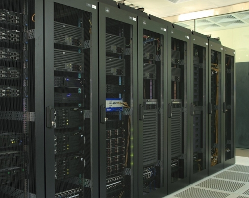

## Web：HTTP协议与服务器环境


Web内容都存储在Web服务器上，任何一台计算机都可以作为一个服务器使用，专业的服务器设备更加稳定耐用。在服务器上运行一个支持HTTP协议的软件称为HTTP服务器软件，或者也叫Web服务器软件。

这个时候往往还需要一个公网IP，绑定一个域名。就可以对外提供服务了。如果仅仅是组织机构内部使用，则不需要，使用内网的IP即可。


#### HTTP版本发展

* 1991年，HTTP/0.9：这个协议只实现了GET请求。


* 1996年，HTTP/1.0：提供了很全面的功能，特点是建立TCP连接传输完成后立即关闭连接。


* 1997年，HTTP/1.1：当前最多使用的版本，默认会支持长连接，协议功能十分复杂，描述HTTP/1.0的RFC 1945规范文档只有60页。而描述HTTP/1.1的RFC 2616规范达到176页。当然这导致了很多问题，并且客户端并没有完全实现所有的功能，而有些最开始被认为很好的并已经实现的功能却很少使用。


* 2015年，HTTP/2：HTTP/2是从Google的SPDY发展过来的协议，当HTTPbits小组决定设计HTTP/2的时候，SPDY已经被大量使用，充分证明了这是一个很好的方案。和之前版本不同的是，HTTP/2使用了二进制格式传输，但是仍然兼容HTTP/1.1的语义。


* HTTP/3已经在制定中，但是已经不再基于TCP协议，而是使用基于UDP协议开发的QUIC协议。


#### 客户端-服务器

客户端使用最多的是浏览器，在程序中使用命令作为客户端发起请求也比较常见。HTTP负责传输存储在服务器上的数据。当前的HTTP版本基于TCP协议，一次请求的过程是：客户端主动发起请求建立TCP连接，然后发送HTTP协议的报文数据，服务器解析数据处理后进行响应，最后关闭连接。

```


/---------    Request                   |*********|
          |   ---------------------->   |         |
  客户端   |	                          |  服务器  |
          |                  Response   |         |
---------/    <----------------------   |_________|

Response返回的数据可以是HTML，JSON，也可以是其他形式的数据，比如文件下载，图片等。
```


#### 命令示例

使用curl命令加上-v选项可以查看详细的处理过程，默认curl仅仅是返回响应结果。比如我们使用NodeJS搭建一个简单的服务：

```javascript
const ant = require('./ant-cur.js');

ant.config.static_path = './static';
ant.config.static_on = true;

ant.get('/', function(req, res) {
    res.end("Success");
});

ant.run('127.0.0.1', 2020);

```


运行curl  -v  ‘http://127.0.0.1:2020/’

```
*   Trying 127.0.0.1...
* TCP_NODELAY set
  % Total    % Received % Xferd  Average Speed   Time    Time     Time  Current
                                 Dload  Upload   Total   Spent    Left  Speed

  0     0    0     0    0     0      0      0 --:--:-- --:--:-- --:--:--     0* Connected to 127.0.0.1 (127.0.0.1) port 2020 (#0)
> GET / HTTP/1.1
> Host: 127.0.0.1:2020
> User-Agent: curl/7.58.0
> Accept: */*
> 
< HTTP/1.1 200 OK
< Date: Fri, 07 Dec 2018 01:37:12 GMT
< Connection: keep-alive
< Content-Length: 7
< 
{ [7 bytes data]

100     7  100     7    0     0   1750      0 --:--:-- --:--:-- --:--:--  2333
* Connection #0 to host 127.0.0.1 left intact
Success
```

现在分块描述响应信息：

```
请求发送的报文：

GET / HTTP/1.1               ---------> 起始行，描述了请求方法，路径，协议版本
Host: 127.0.0.1:2020       |
User-Agent: curl/7.58.0    | ---------> 首部
Accept: */*                |
                           > ----------> 主体

主体数据可以没有，这里发送的是GET请求，如果是POST请求就会有主体信息，响应报文也是这样的格式。
```

这个就是HTTP最核心的流程，请求头信息有更多的字段用于描述数据信息。HTTP/1.1主要使用两个方法：GET，POST。除此以外还有PUT，DELETE，OPTIONS，HEAD。GET用于获取资源，POST用于提交数据，一般登录，注册的表单提交操作都是POST请求。

响应数据数据如果是HTML，浏览器会识别并解析处理，其中引入的CSS，JS文件，这些操作都是浏览器的操作。数据传输完成，HTTP协议的工作就已经完成了。


#### 搭建站点的必备条件

* 一台服务器设备（可以是虚拟主机，云服务器）
* 支持HTTP协议的服务软件（Nginx，Apache，LightHttpd ...）
* 一种或多种编程语言的开发环境（PHP，NodeJS，GO，Python ...）
* 数据库软件（SQLite，MySQL/MariaDB，PostgreSQL，MongoDB ...），尽管这不是必须，但现在的服务都离不开。


#### 服务器环境

对于要搭建服务器环境对外提供服务来说，有多种选择。尽管你可以把你的设备作为服务器，放在什么地方都随便你决定，但是为了提供稳定的服务环境，机器运行的环境是有严格要求的，专业的机房对温湿度，静电，电力环境等都有要求。

* **虚拟主机：**这种情况其实是很多人共享一台主机，并提供一个特定的环境，以PHP环境居多，也有ASP和JSP环境，现在也有NodeJS环境，PHP环境居多是因为其支持热部署，操作灵活方便的特性。虚拟主机有特别便宜甚至免费的空间，也有比较贵的。特点是用户只能选则主机提供的环境，只能把文件上传到指定的目录，并且不安全，而且其他站点出现问题可能导致自己的网站受影响，现在比较好的提供独立IP的虚拟主机。因为是分配了一个空间给用户，很多用户共享一台设备，所以被称为虚拟主机，不是真的拥有一台设备。


* **云服务器：**目前比较流行的也是体验比较好的云计算环境，国内比较有名的是阿里云和腾讯云。其他巨头公司也有云服务环境，但是很难有影响力，中小型的创业公司也有很多，从个人使用来说，体验比较差。云服务器相当于一个远程的主机，可以通过IP地址进行远程连接，可以选择操作系统，可以重置系统，自由选择开发环境，自主可控性很高。并且可以根据需求自由选择配置。多数创业公司选择云服务器，除以上优势以外，云服务器提供商也会提供一些DDOS攻击，暴力破解等攻击的保护，并且会保证数据安全以及设备安全。所以专业的公司提供的服务更好，国际知名的有AWS，Azure等。对创业公司来说成本相对较低。


* **主机托管：**这是一种比较昂贵的方式，你自己买了几台服务器设备，找到最近的机房，一般联通/电信的机房都会提供托管服务，你去申请，会给你分配机柜位置。每年要缴纳托管费用。主要用到的是标准的数据中心的环境以及分配的公网IP，除此以外没有其他服务，需要你自己配备非常专业的人员去管理。一切服务器设备问题，网络攻击，数据安全问题都需要自己维护解决。



* **自建机房：**成本最高的方式，一般大公司都会采用。使用云服务器，一个比较敏感的问题是，云服务器提供商实际上有能力获取到你的数据，设备以及系统环境都是它提供的，真正的最高权限是云服务器提供商，并且由于商业竞争，很容易因为数据问题被搞垮，所以大公司都有自己的机房保证数据安全。自建机房需要购买机柜，服务器主机，UPS（不间断电源，需要对接蓄电池），去通信公司（联通/电信/移动）申请公网IP。每年要向通信公司缴纳巨额资金。设备要专业人员维护，也要定期更换。


#### 如何搭建一个简单的站点

比如你想搭建一个博客类的网站，发布你自己的文章，同时也能支持其他人编辑发布他们的文章。那么你需要做以下操作：

**购买虚拟主机或者是云服务器：**比如你购买了云服务器，这时候会给你分配一个公网IP，但是总不能让大家通过IP地址访问，而且一些对接其他服务的功能是需要域名的。

**注册并购买域名：**域名要绑定到你购买的云服务器IP地址，这个操作被称为DNS域名解析。云服务器提供商都会提供此操作，登录控制台设置即可，购买一个域名后，可以自己分配二级域名，比如www.a.com、ftp.a.com。

**搭建开发环境：**推荐使用LNMP架构，Nginx设置好网站根目录以及域名配置。（实际过程有些复杂，因为需要了解LNMP环境，需要了解PHP。）

**部署：**如果你不想开发，想找到一个现成的系统直接使用，那就是WordPress，这个世界上使用最广泛的博客系统，当然已经可以用来做企业官网甚至小型店商，有大量主题，插件可以选择。（对于其他语言，也有其他成型的系统，不过也需要了解那些开发环境，而且可选择的没有那么多或者是需要二次开发才可以使用。）

这里是一个简单的示例，并且WordPress有详细的安装过程，实际效果，可以访问 a.d5h5.com查看，这是一个使用WordPress搭建的站点。